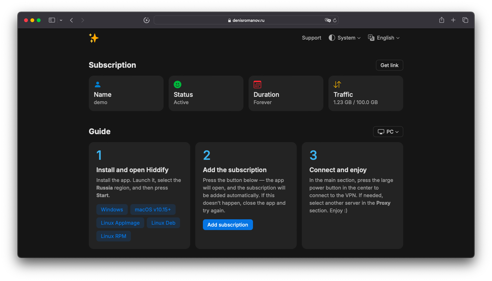
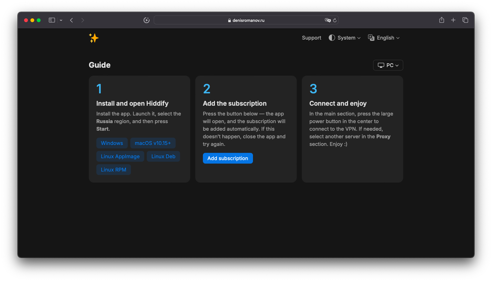

<h3 align="center">Marzbanify Template</h3>

<p align="center">
  Simple, beautiful, and user-friendly HTML template for <a href="https://github.com/Gozargah/Marzban">Marzban</a> subscription page
  <br>
  <a href="https://denisromanov.ru/projects/marzbanify-template-demo"><strong>Live demo »</strong></a>
  <br>
  <br>
  <a href="https://github.com/dermv/marzbanify-template/tree/main#features">Features</a>
  ·
  <a href="https://github.com/dermv/marzbanify-template/tree/main#mini-version">mini Version</a>
  ·
  <a href="https://github.com/dermv/marzbanify-template/tree/main#installation">Installation</a>
  ·
  <a href="https://github.com/dermv/marzbanify-template/tree/main#personalization">Personalization</a>
</p>

<p>
  <picture>
    <source media="(prefers-color-scheme: dark)" srcset="./.github/assets/dark.png">
    <source media="(prefers-color-scheme: light)" srcset="./.github/assets/light.png">
    
  </picture>
</p>

## Features

- The design is simple and intuitive, with minimal code.
- Theme switching: system, light, and dark modes.
- Language switching: English, Russian, Chinese, and Persian.
- Guides are provided for PC, Android, and iOS.
- Automatic detection of the user's theme, language, and device.

## mini Version
Maximum minimalism: just the header and guide, nothing extra.
<br>
<a href="https://denisromanov.ru/projects/marzbanify-template-mini-demo">Live demo »</a>

<p>
  <picture>
    <source media="(prefers-color-scheme: dark)" srcset="./.github/assets/mini/dark.png">
    <source media="(prefers-color-scheme: light)" srcset="./.github/assets/mini/light.png">
    
  </picture>
</p>

## Installation

1. Upload the file to the server.
```
sudo wget -O /var/lib/marzban/templates/subscription/index.html https://raw.githubusercontent.com/dermv/marzbanify-template/main/index.html
```
For mini version:
```
sudo wget -O /var/lib/marzban/templates/subscription/index.html https://raw.githubusercontent.com/dermv/marzbanify-template/main/mini/index.html
```
2. Enter these commands to automatically specify the file path to the subscription page.
```
echo 'CUSTOM_TEMPLATES_DIRECTORY="/var/lib/marzban/templates/"' | sudo tee -a /opt/marzban/.env
echo 'SUBSCRIPTION_PAGE_TEMPLATE="subscription/index.html"' | sudo tee -a /opt/marzban/.env
```
Or specify them manually by editing the Marzban `.env` file.
```
CUSTOM_TEMPLATES_DIRECTORY="/var/lib/marzban/templates/"
SUBSCRIPTION_PAGE_TEMPLATE="subscription/index.html"
```
3. Restart Marzban to apply the changes.
```
marzban restart
```

## Personalization

To customize, edit the `index.html` file and replace the following default values with your own.

### Main Variables

- Description.
```
Simple, beautiful, and user-friendly HTML template for Marzban subscription page.
```
- Title.
```
Marzbanify Template
```
- Favicons.
```
https://raw.githubusercontent.com/dermv/marzbanify-template/refs/heads/main/img/apple-touch-icon.png
https://raw.githubusercontent.com/dermv/marzbanify-template/refs/heads/main/img/favicon-16x16.png
https://raw.githubusercontent.com/dermv/marzbanify-template/refs/heads/main/img/favicon-32x32.png
```
- Support link.
```
https://t.me/
```
- Logo.
```
https://raw.githubusercontent.com/dermv/marzbanify-template/refs/heads/main/img/logo.png
```

### Optional Variables

- Defines the default website theme used when the user hasn't selected a different one.
```
const DEFAULT_THEME = 'system';
```
- URL schemes for quick subscription import.
```
const SUB_URL_SCHEMES = {
  pc: `hiddify://import/${SUB_URL}`,
  android: `hiddify://import/${SUB_URL}`,
  ios: `hiddify://import/${SUB_URL}`,
};
```
- Default locale used to display content if the user's locale is not specified.
```
const DEFAULT_LOCALE = 'en';
```
- Translation data in `const MESSAGES`.
